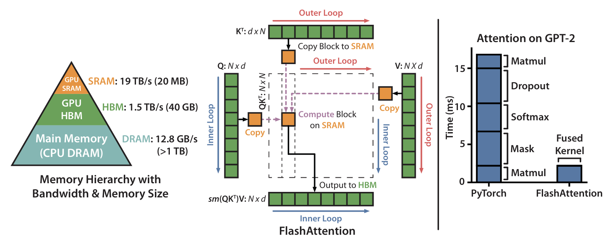
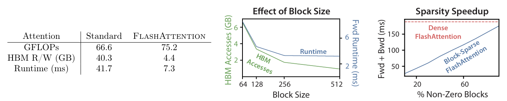
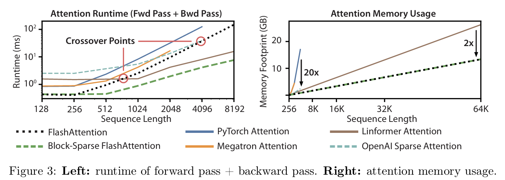

# FlashAttention: Fast and Memory-Efficient Exact Attention with IO-Awareness

PyTorch implementation of the paper [FlashAttention: Fast and Memory-Efficient Exact Attention with IO-Awareness](https://arxiv.org/pdf/2205.14135)

This paper presents **FlashAttention**, an IO-aware exact attention algorithm that restructures attention to minimize slow GPU memory (HBM/DRAM) accesses by tiling Q, K, V into blocks, performing attention inside fast on-chip SRAM, and recomputing small pieces when needed. The result is an attention implementation that is both faster in wall-clock time and more memory-efficient (linear in sequence length), without approximating the attention math. :contentReference[oaicite:0]{index=0}

FlashAttention’s core ideas:
- **IO-awareness & tiling:** split Q/K/V into tiles that fit in SRAM and stream them through nested loops so intermediate N×N attention matrices are never materialized in slow memory. This reduces HBM reads/writes compared to standard attention. :contentReference[oaicite:1]{index=1}  
- **Recomputation for backward pass:** store compact normalization factors during the forward pass and recompute necessary quantities on-chip for the backward pass, avoiding storing the full attention matrix. :contentReference[oaicite:2]{index=2}  
- **Kernel fusion & CUDA implementation:** fuse matmul → mask → stable softmax → dropout → matmul into a single CUDA kernel per tile to eliminate extra kernel launches and memory traffic; the authors provide a CUDA implementation and open-source code. :contentReference[oaicite:3]{index=3}

Key theoretical and empirical claims:
- **IO complexity and optimality:** the paper analyzes HBM IO and shows FlashAttention requires asymptotically fewer HBM accesses (O(N² d² M⁻¹) under their model) and gives a lower bound demonstrating no exact attention algorithm can asymptotically beat their HBM access count across SRAM sizes. :contentReference[oaicite:4]{index=4}  
- **Wall-clock speedups & quality:** FlashAttention yields large speedups in practice (examples include ~3× on GPT-2 for N=1K, 15% end-to-end training speedup on BERT-large for N=512, and multi× improvements on long-sequence benchmarks), enabling longer contexts that improve model quality (e.g., better perplexity and new capabilities on Path-X). :contentReference[oaicite:5]{index=5}

Why this matters (practical takeaways):
- If your transformer is memory-bound at longer sequence lengths, FlashAttention often gives immediate wall-clock benefits by reducing memory traffic rather than only reducing FLOPs. :contentReference[oaicite:6]{index=6}  
- Implementing it requires careful tile sizing per GPU, a numerically stable incremental softmax (track tile maxima/sums), and handling recomputation cost vs. memory savings. The biggest engineering win comes from correct CUDA kernel fusion and using on-chip SRAM effectively. :contentReference[oaicite:7]{index=7}

Short summary: FlashAttention shows that rethinking attention as an IO-aware, tiled, and fused GPU kernel yields exact attention that is substantially faster and more memory-efficient in practice — opening the door to longer contexts and faster Transformer training without approximating attention. :contentReference[oaicite:8]{index=8}


## Dataset Preparation

This project utilizes the WMT14 dataset, a widely used benchmark for machine translation research. Specifically, the French-to-English translation subset is employed as the source text data.

The dataset provides parallel sentence pairs and is commonly used for training and evaluating language models in translation and general natural language understanding tasks. A random sampling strategy is applied to select English or French sentences from the dataset for model training.

To process the text data, the GPT-3 Byte-Pair Encoding (BPE) tokenizer ("cl100k_base") is employed. This tokenizer converts raw text into token sequences compatible with GPT-3 style language models.

# FlashAttention — Figure

- FlashAttention idea: perform attention in tiles inside fast on-chip memory and fuse the attention pipeline to minimize memory traffic and kernel launches.

## 1) Memory hierarchy (left)
- GPUs have a small, very high-bandwidth on-chip SRAM (shared memory / L1) and a larger, slower HBM; CPU DRAM is even larger but far lower bandwidth.  
- FlashAttention minimizes transfers between HBM/DRAM and SRAM by performing as much work as possible inside SRAM, which is the key to reducing end-to-end latency.

---

## 2) Tiled attention algorithm (center)
1. **Tile Q, K, V** — split queries (Q), keys (K), and values (V) into tiles sized to fit SRAM/shared memory.  
2. **Copy Kᵀ tile to SRAM** — load a Kᵀ tile (or its transpose) into on-chip SRAM to reuse it across multiple Q tiles.  
3. **Copy Q tile to SRAM** — load one Q tile into SRAM (inner loop) and stream across Kᵀ tiles (outer loop).  
4. **Compute attention block in SRAM** — compute the small matrix multiply Q·Kᵀ for the current tile, apply masking, compute stable softmax, optionally apply dropout, and multiply by V — *all while keeping intermediate tensors in SRAM*.  
5. **Accumulate and write outputs** — accumulate partial outputs for the Q tile and write the final `sm(QKᵀ)V` result back to HBM/DRAM when complete.  
- The nested loops (outer over K/V tiles, inner over Q tiles) maximize data reuse and drastically reduce reads/writes to slow memory.

---

## 3) Performance implication (right)
- The PyTorch/naïve implementation performs many separate kernels (matmul, mask, softmax, dropout, another matmul), causing multiple HBM ↔ SRAM round trips per attention.  
- FlashAttention fuses those operations into a single compute kernel per tile (matmul + mask + softmax + dropout + matmul), which reduces memory traffic and yields a large wall-clock speedup (shown as a small single bar for the fused kernel).

=============================================

## GPT-3 Learning Performance

### **Axes**
- **X-axis**: Number of examples provided in the context (*K*).
- **Y-axis**: Accuracy (%) on the evaluation task.

### **Model Sizes**
- **175B Parameters** (blue)
- **13B Parameters** (orange)
- **1.3B Parameters** (green)

### **Prompting Styles**
- **Natural Language Prompt** (solid line): A descriptive instruction or example.
- **No Prompt** (dashed line): The task is given without any introductory instruction.

### **Key Observations**
1. **Zero-shot (0 examples)**  
   - The largest model (175B) shows high baseline accuracy (8%) without examples.
   - Smaller models start near 0%, indicating limited zero-shot ability.

2. **One-shot (1 example)**  
   - Adding just one example greatly boosts accuracy for large models (175B jumps to 45%).
   - Mid-size (13B) and small (1.3B) models show smaller gains.

3. **Few-shot (10 - 100 examples)**  
   - Accuracy increases steadily with more examples in context.
   - The 175B model approaches 67% accuracy with enough examples, showing strong in-context learning.
   - The gap between "Natural Language Prompt" and "No Prompt" narrows as more examples are given.

4. **Scaling Effect**  
   - Larger models benefit significantly more from few-shot prompting.
   - Smaller models (1.3B) barely improve, suggesting that in-context learning ability scales with parameter count.
=============================================
## 🔹 Aggregate Performance Across Benchmarks

### **Axes**
- **X-axis**: Model size in billions of parameters (from 0.1B to 175B).
- **Y-axis**: Accuracy (%) across all evaluated benchmarks.

### **Key Observations**
   **Scaling Improves Performance**
   - All three modes (few-shot, one-shot, zero-shot) improve steadily as model size increases.
   - Few-shot consistently outperforms one-shot and zero-shot across all model sizes.
   - The largest model (175B) achieves:
     - **Few-Shot**: ~58% accuracy
     - **One-Shot**: ~51% accuracy
     - **Zero-Shot**: ~42% accuracy

## In-Context Learning vs. Traditional Fine-Tuning

### **In-Context Learning (No Parameter Updates)**
The model answers based on the task description and provided examples **within the prompt**.  
No gradient updates are performed during inference.

#### **Zero-Shot**
- **Description**: Only the task description is given, no examples.
- The model infers the answer solely from its pre-trained knowledge.

#### **One-Shot**
- **Description**: Task description + one example.
- The single example helps guide the model’s translation.

#### **Few-Shot**
- **Description**: Task description + multiple examples (10 - 100 examples).
- - Multiple examples allow the model to better understand the pattern before answering.

---

### **Traditional Fine-Tuning (Not Used for GPT-3)**
- The model is trained with **repeated gradient updates** on a large set of labeled examples for a specific task.
- Process:
1. Input an example (`sea otter => loutre de mer`)
2. Compute loss and apply a gradient update.
3. Repeat for all training examples.
4. After fine-tuning, the model is specialized for that task.
- GPT-3 skips this step and relies solely on **in-context learning** during evaluation.

## Scaling Laws: Validation Loss vs. Compute

### **Axes**
- All curves follow a **power-law relationship** between compute and loss.
- **X-axis**: Compute measured in **PetaFLOP/s-days** (log scale).
- **Y-axis**: Validation loss (lower is better).
- **Color Gradient**: Number of model parameters (**10⁵** (purple) to **10¹¹** (yellow)).

---

### **Observations**
1. **Consistent Scaling Behavior**
   - Across all parameter sizes, increasing compute reduces validation loss.

2. **Larger Models Require More Compute**
   - Small models (purple/blue) reach optimal loss with relatively little compute.
   - Large models (green/yellow) need **massively more compute** to fully utilize their capacity.

## **GPT-3 Training Curves

## **Axes
**X-axis**: Tokens elapsed (billions).  
**Y-axis**: Cross-entropy loss (nats/token, smoothed).  
**Color gradient:** Number of model parameters (**10⁸** to (purple) **10¹¹** (yellow)).  

### **Observations**
**1. Early rapid improvement**  
- Loss drops steeply in the initial phase (first ~20B tokens).

**2. Diminishing marginal gains**  
- After the sharp early decrease, loss continues to fall but more slowly—each additional billion tokens yields smaller improvements, especially for smaller models.

**3. Train vs. validation gap**  
- Validation loss is consistently slightly higher than training loss. The gap is larger for smaller models, indicating relatively weaker generalization.

## Configuration
```python
class GPT3Config:
    def __init__(self):
        self.vocab_size = 50257     # Size of the GPT-3 tokenizer vocabulary
        self.d_model = 768          # Model hidden dimension (GPT-3 175B uses 12288)
        self.n_layers = 12          # Number of Transformer decoder layers (GPT-3 175B uses 96 layers)
        self.n_heads = 12           # Number of attention heads per layer (GPT-3 175B uses 96 heads)
        self.d_ff = 3072             # Feed-forward network hidden dimension (GPT-3 175B uses 49152)
        self.dropout = 0.1           # Dropout rate (GPT-3 paper did not use dropout)
        self.max_seq_len = 512       # Maximum sequence length (GPT-3 uses up to 2048 tokens)
        self.lr = 1e-4                # Learning rate for Adam optimizer
        self.betas = (0.9, 0.95)     # Beta values for Adam optimizer
        self.eps = 1e-8              # Epsilon for numerical stability in Adam optimizer
        self.weight_decay = 0.0      # Weight decay for regularization
        self.device = 'cuda' if torch.cuda.is_available() else 'cpu'  
                                     # Automatically select GPU if available, else use CPU
```

## Counting French Words in Dataset Samples

This analysis inspects the frequency of common French keywords within a subset of dataset texts, providing insights into the multilingual nature of the dataset used for training.

### Methodology
- A list of frequent French keywords (e.g., "le", "la", "et", "de", "bonjour", "merci", "oui") is defined.
- The first 100,000 text samples from the dataset are examined.
- Each text is wrapped with spaces to detect whole word matches accurately.
- The script counts occurrences of each French keyword and tallies total keyword hits, including multiple hits from the same text.

### Results
- The sample size analyzed consists of 100,000 texts.
- Keyword counts show notable presence of French terms, such as "de" (27,004 occurrences), "la" (20,810), "que" (17,701), "et" (17,140), and "à" (16,463).
- The total French keyword occurrences counted are 125,710, indicating multiple keywords often appear in a single text.

### Training Progress Context
The dataset was used to train a GPT-3 style model over 5 epochs. Training logs indicate steady loss reduction across epochs:
- Epoch 1 loss: 4.62
- Epoch 2 loss: 3.6
- Epoch 3 loss: 3.2
- Epoch 4 loss: 2.98
- Epoch 5 loss: 2.83

## Zero-Shot Testing Results and Future Directions

### Zero-Shot Text Generation

A zero-shot evaluation was performed to test the model’s ability to generate French translations given English prompts using a sampling-based decoding method with top-k filtering.

**Test Prompts:**
- "English: Good morning.\nFrench:"
- "English: Thank you for your help.\nFrench:"
- "English: I enjoy learning new things.\nFrench:"

**Observations:**
- The generated outputs failed to produce coherent or relevant French translations.
- Instead, the outputs were mostly nonsensical, random token sequences, indicating the model has not effectively learned the translation or language generation task.

### Training Context and Limitations

- The model was trained for 5 epochs on a limited portion of the WMT14 dataset.
- Training loss decreased steadily, but the final performance does not yet reflect practical language generation capabilities.

### Future Work

These results highlight the need for training on a much larger and more diverse dataset to improve language understanding and generation. Expanding the dataset size and training time would enable the model to better capture language patterns and semantics, essential for tasks like translation and zero-shot generation.

Increasing dataset scale, potentially incorporating various multilingual corpora and larger token counts, will be critical for achieving meaningful and coherent generative behavior in GPT-3 models.

### Test Prompts:
- "English: Good morning.\nFrench:"
- "English: Thank you for your help.\nFrench:"
- "English: I enjoy learning new things.\nFrench:"

### Observations:
- Despite the one-shot context, the model repeatedly outputs the example translation phrase instead of producing meaningful translations for the new prompts.
- The generated continuations devolve into incoherent, nonsensical token sequences unrelated to the intended French translations.
- This indicates the model is unable to generalize from the single demonstration and generate valid translations given the current training state.

### Summary

The one-shot testing results align with zero-shot findings, demonstrating that the model’s current training state is insufficient for producing coherent language generation or translation in this scenario.

## Few-Shot Testing Results

### Test Prompts:
- "English: Good morning.\nFrench:"
- "English: Thank you for your help.\nFrench:"
- "English: I enjoy learning new things.\nFrench:"

### Observations:
- Despite the improved prompting strategy with multiple examples, generation quality remains poor.
- The model continues to repeat the example examples verbatim and produces largely unintelligible or irrelevant continuations.
- No meaningful or accurate French translations are generated for the new test prompts.

### Summary

The few-shot setting provides more contextual clues but is still insufficient for the current model to produce coherent outputs. This indicates the model requires further training and exposure to larger, higher-quality datasets to enable effective few-shot learning and generalization.

Ongoing improvements in dataset scale, model capacity, and training duration will be necessary to achieve the level of performance demonstrated by state-of-the-art GPT-3 models.

## Final Remarks

This project presents a PyTorch implementation inspired by GPT-3, demonstrating key concepts from the original "Language Models are Few-Shot Learners" paper. The work includes dataset preparation, training on the WMT14 translation dataset, and evaluations under zero-shot, one-shot, and few-shot scenarios.

Although training loss steadily decreased over 5 epochs, the current model struggles to generate coherent and relevant French translations, as evidenced by the zero-, one-, and few-shot tests. These results highlight the challenges of scaling language models and the critical importance of large, diverse training data to achieve strong in-context learning and generation capabilities.

Future work will focus on training with substantially larger datasets and extended compute resources to better approximate the performance characteristics reported by the original GPT-3 model, enabling the development of more robust few-shot learning abilities.
